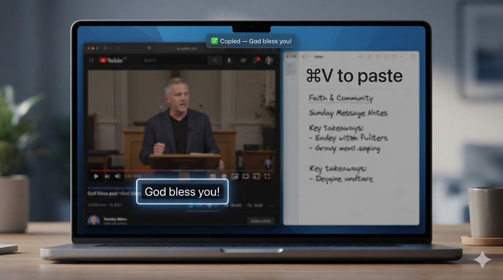

# autoOCR

> **영역 선택과 복사의 번거로움을 없앴습니다. 자막을 바로 붙여넣기만 하면 됩니다.**

화면의 자막 영역을 한 번 지정해두면, autoOCR이 그 부분을 실시간으로 읽어
**자동으로 텍스트로 만들고 클립보드에 복사**합니다. 당신은 노트에 `⌘V`만 누르면 됩니다.



## 왜 autoOCR인가요?

영상을 보다 보면 좋은 자막일수록 순식간에 지나가 버립니다. 손으로 받아적다 보면 이미 다음 화면.
autoOCR은 유튜브 강연·설교, 인강, 슬라이드 등 **자막이 있는 어떤 화면이든** 그 자리에서 텍스트로 만들어 줍니다.

- **Apple Vision** 온디바이스 OCR — 네트워크 전송 없음, 완전 로컬
- **메뉴바 상주** — 창이 화면을 가리지 않음
- 한국어·영어·일본어·중국어·자동 감지 지원

## 주요 기능

| 기능 | 설명 |
|------|------|
| 영역 선택 캡처 | 드래그로 자막 영역을 지정하면 곧바로 실시간 인식 시작 |
| 실시간 OCR | 설정한 주기(0.5–60초)마다 인식. 화면이 그대로면 건너뛰어 CPU 절약 |
| 누적 모드 | 새 자막을 지우지 않고 이어붙여 강연 전체를 기록 |
| 자동 복사 | 새 텍스트가 인식될 때마다 클립보드에 자동 복사 |
| 캡션 미러 | 화면 하단에 캡처된 텍스트를 자막처럼 표시 (항상 띄워두기 가능) |
| 지금 캡처 | 간격을 무시하고 현재 화면을 즉시 한 번 캡처 |
| 전역 단축키 | 어디서든 영역 선택·즉시 캡처. 사용자 지정 + 충돌 방지 |
| OCR 품질 설정 | 업스케일·대비·이진화·언어보정·하이브리드(다중 전처리 비교) |

## 단축키 (기본값)

| 동작 | 단축키 |
|------|--------|
| 영역 선택 | `⌘⇧0` |
| 지금 캡처 | `⌘⇧9` |
| 전체 결과 복사 | `⌘C` (패널 활성 시) |
| 앱 종료 | `⌘Q` |

> 단축키는 설정에서 자유롭게 바꿀 수 있으며, 다른 단축키와 충돌하면 저장이 막히고 안내가 표시됩니다.

## 사용법

1. 앱을 실행하면 메뉴바에 autoOCR 아이콘이 나타납니다.
2. 아이콘을 눌러 패널을 열고 **영역 선택**(또는 `⌘⇧0`)으로 자막 영역을 드래그합니다.
3. 선택 즉시 실시간 인식이 시작되고, 인식된 텍스트가 클립보드에 복사됩니다.
4. 노트 등에 `⌘V`로 붙여넣습니다.

첫 실행 시 **화면 녹화 권한**이 필요합니다:
시스템 설정 › 개인정보 보호 및 보안 › 화면 기록에서 **autoOCR**을 켠 뒤 앱을 다시 실행하세요.

## 빌드 / 실행

- **요구 사항**: macOS 15.4+, Xcode 16+
- 저장소를 열고 `autoOCR.xcodeproj`를 Xcode에서 실행(⌘R)하면 됩니다.

```bash
git clone <this-repo-url>
cd autoOCR
open autoOCR.xcodeproj
```

> 개발 서명(ad-hoc) 특성상 재빌드 시 화면 녹화 권한이 초기화될 수 있습니다.
> 안정적으로 쓰려면 저장소의 `resign-and-deploy.sh`로 고정 인증서 재서명 후 사용하세요.

## 기술 스택

- **SwiftUI** — UI, 메뉴바(MenuBarExtra)
- **ScreenCaptureKit** — 지정 영역 화면 스트림 캡처
- **Vision** — 온디바이스 텍스트 인식 + CoreImage 전처리
- **Carbon** — 전역 단축키(RegisterEventHotKey)

## 로드맵

- [ ] PaddleOCR(CoreML) 하이브리드로 CJK 인식 정확도 향상
- [ ] 캡션 미러 위치/크기 사용자 조절
- [ ] 인식 결과 히스토리 관리 및 내보내기 개선
- [ ] App Store 배포

## 라이선스

미정 (TBD)
